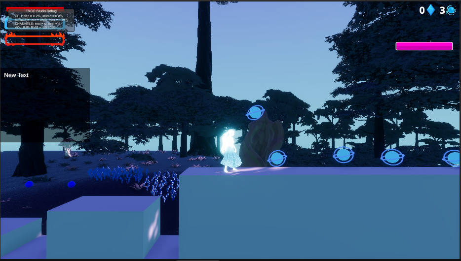
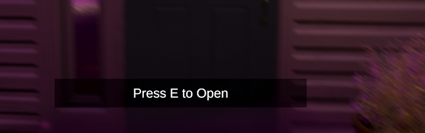
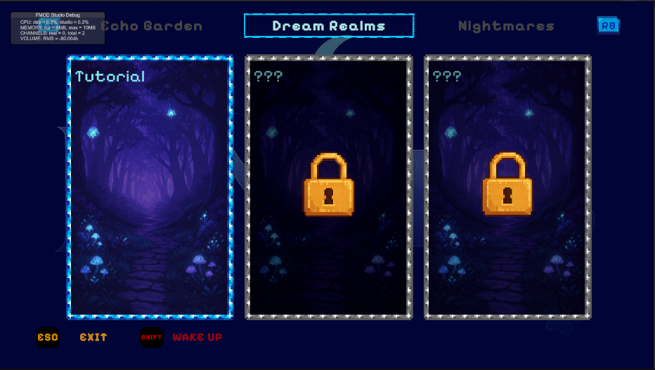
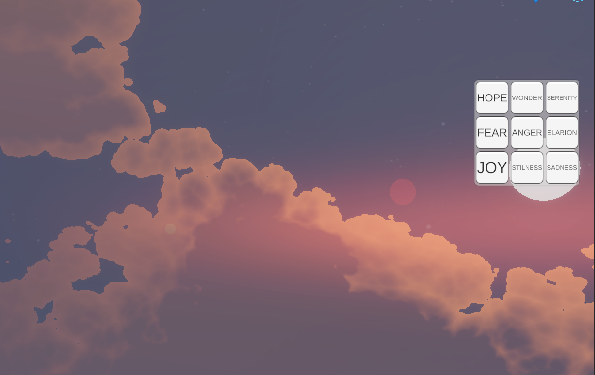
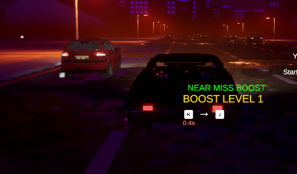
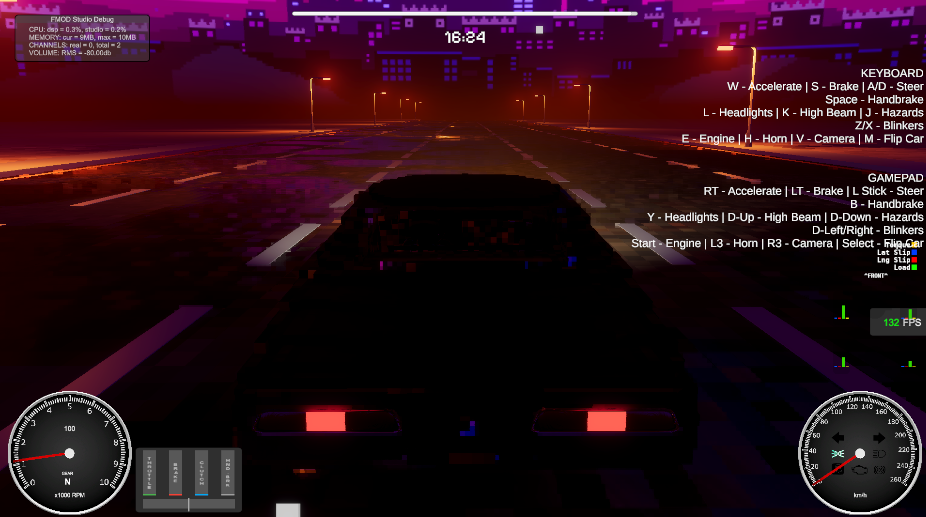

# Lunoris — Game Design Document (As-Is). Quick Start

> **What is this:** Documentation of the current state of the game.  
> **Format:** Wiki-structure, short pages, practical examples.  
> **Goal:** Onboarding new team members + documenting "what actually works".

---
## 🗺️ Introduction

**Lunoris** — a 3D adventure game with elements of:
- Traveling between real and phantom worlds
- Racing/runner mode with drifting
- Combat like in Zelda/Genshin Impact
- Progression and quest system
- Dialogues
  
The project positions itself as a game with multiple mini-games inside (similar example - Miside), and the vibe is very similar to GRIS (2018)

---

## 🗺️ Scenes

### DayHome
Real world, an ordinary house in an evening atmosphere. The starting point of the game with several dialogue interactions with objects (sleeping dog, painting, and cello). From here you can access any level except CarLevel through interaction with the bed.

| Category | Contents |
|----------|----------|
| **Mechanics** | Hybrid player controller, Dialogue system, Object interactions, Bed animator, Prompt system, Bed cutscene (part 1) |
| **Characters** | Lunora (real form) |
| **Resources** | - |
| **UI** | Pause menu, Settings windows, Dialogue window, Quest panel, Level select, Prompt panel |

---

### DreamHub
World of dreams/fantasies, a distorted house in purple tones. Here an active companion Dog appears, who follows the player and looks at them. From here you can go through the mirror to NightmareHub, through objects to Dream levels (only Tutorial), and through interaction with the bed to any level, as well as to the secret Car Level by going outside and interacting with the car.

| Category | Contents |
|----------|----------|
| **Mechanics** | Dialogue system, Hybrid player controller, Interaction system, Bed animator, Balcony cutscene, Bed cutscene (part 2), Prompt system, Simple NPC |
| **Characters** | Lunoris (phantom form), Dog |
| **Resources** | — |
| **UI** | Main menu, Pause menu, Settings windows, Quest panel, Resource panel, Level select, Prompt panel |

---

### NightmareHub
World of nightmares/fears, a distorted house in red tones. From here you can go through the mirror to DreamHub, through objects to Nightmare levels (Nightmare Level).

| Category | Contents |
|----------|----------|
| **Mechanics** | Dialogues, Hybrid player controller, Interaction system, Prompt system |
| **Characters** | Lunoris (phantom form) |
| **Resources** | — |
| **UI** | Pause menu, Settings windows (graphics and sound), Quest panel, Prompt panel |

---

### Tutorial
Side-view level where you need to jump over all obstacles and reach the portal, opening chests and solving puzzles along the way. The dog runs in the background and collects resources.

| Category | Contents |
|----------|----------|
| **Mechanics** | Malbers Player Controller, Malbers NPC, Prompt system, Interaction system |
| **Characters** | Lunoris, Dog |
| **Resources** | Stress Bar, Lucid Points, Echo Shard |
| **UI** | Pause menu, Settings windows, Quest panel, Resource panel, Dialogue window, HP Bar, Prompt panel |

The team decided to remove it, so the level is in the deletion queue!

---

### Elar (Open World)
Open world level, currently accessible only from the Unity editor. The world is divided into 9 segments, each with its own atmosphere and weather. Currently there is no level design — just flat ground.

| Category | Contents |
|----------|----------|
| **Mechanics** | Hybrid player controller, Open world, Weather, Debug teleport |
| **Characters** | Lunoris |
| **Resources** | — |
| **UI** | Pause menu, Settings windows, Quest panel, Resource panel, Prompt panel, Debug teleport |

**Elar Segments:**

| # | Segment | Atmosphere |
|---|---------|------------|
| 1 | GardenOfAnger | Stormy evening with thunderstorm, lightning and gusty wind |
| 2 | GardenOfElarion | Rare midday light with magical shimmer in the air |
| 3 | GardenOfFear | Gloomy night with oppressive darkness and cold haze |
| 4 | GardenOfHope | Warm sunrise with soft golden light and birdsong |
| 5 | GardenOfJoy | Bright sunny day with clear sky and warm breeze |
| 6 | GardenOfSadness | Quiet midnight with light rain and dense fog |
| 7 | GardenOfSerenity | Calm clear day with soft clouds and light breeze |
| 8 | GardenOfStillness | Windless morning with still air and light haze |
| 9 | GardenOfWonder | Magical midnight with starry sky and glowing particles |

The player can reach any segment by walking through the world (they load dynamically when approaching) or through debug teleportation.

---

### Car Level
Racing level in runner style. The player controls a Chevrolet Impala, drives forward and tries to avoid accidents by maneuvering/drifting.

**Features:**
- Cars in the left lane yield when flashing lights or when approaching too close
- When passing close to obstacles (50% chance) a QTE of 2 keys appears → boost
- 3 boost levels: 110% → 130% → 170% speed
- At maximum boost — 10 sec on upper road level without obstacles + Lucid Points
- Level ends when timer runs out (currently 1000 sec for debugging)

| Category | Contents |
|----------|----------|
| **Mechanics** | Realistic car controller, Road generation system, QTE system |
| **Characters** | Chevrolet Impala 1967 |
| **Resources** | Lucid Points |
| **UI** | Pause menu, Settings windows, Car UI, QTE window |

---

### Nightmare Level (Nightmare Level)
Nightmare level — a rocky wasteland in red tones with blackout. Goal: reach the teleport and kill all enemies.

**Enemies:** 2× Light enemy + 1× Ghost (Creature is disabled, but can be enabled)

**Combat system:**
- Light combo — fast light attacks
- Heavy combo — slow heavy attacks
- Dodge — accompanied by slow-mo
- Parry — accompanied by slow-mo
- **Lucid Rush:** activates when LucidMeter is full (0→100), +50 for successful dodge/parry. On activation: time slowdown + 3 QTE with combos. Each successful QTE: +50% damage (up to +150%). Penalty for failure — player stun for 2 sec.

| Category | Contents |
|----------|----------|
| **Mechanics** | Malbers Player Controller, Malbers NPC, QTE system, Combo system |
| **Characters** | Lunoris, Light enemy ×2, Ghost, (Creature — optional) |
| **Resources** | Lucid Points, Lucid Meter |
| **UI** | Pause menu, Settings windows, Resource panel, Lucid Meter Bar, HP Bar, QTE window |

---

## 👤 Characters/Entities

> 📁 More details: [characters/](characters/index.md)

| Character | Description | Scenes |
|-----------|-------------|--------|
| [Lunora/Lunoris/Kurtam](characters/lunora.md) | Main heroine, two forms + animal form | All |
| [Dog](characters/dog.md) | Main heroine's companion | DreamHub, Tutorial |
| [Chevrolet Impala 1967](characters/impala.md) | Player's car | Car Level |
| [Light enemy](characters/light-enemy.md) | Humanoid placeholder, random weapon | Nightmare Level |
| [Creature](characters/creature.md) | Strong opponent, melee + ranged combat | Nightmare Level |
| [Ghost](characters/ghost.md) | Flying enemy placeholder | Nightmare Level |

---

## 💎 Resources
- **Loneliness Bar** — loneliness meter, not used anywhere.
- **Stress Bar** — stress meter (used only in 2.5D level). Accumulates only when taking damage, 35 units per hit. Affects where the character ends up upon death in 2.5D level
- **Echo Shard** — echo shards, collectible resource. Can be obtained from chests in 2.5D level. Not used anywhere.
- **Lucid Points** — lucidity points, earned in Car Level on the upper road level and for successful actions. Just accumulates and is not used anywhere.
- **Lucid Meter** — lucidity meter in combat (0→100). +50 for successful dodge/parry. When full, activates [Lucid Rush](mechanics/lucid-rush.md).

---

## ⚙️ Mechanics

> 📁 More details: [mechanics/](mechanics/index.md)

### Controllers
| Mechanic | Description | Scenes |
|----------|-------------|--------|
| [Hybrid controller](mechanics/hybrid-controller.md) | 1st and 3rd person, no combat | DayHome, DreamHub, NightmareHub, Elar |
| [Malbers controller](mechanics/malbers-controller.md) | Combat, advanced Locomotion | Tutorial, Nightmare Level |
| [Car controller](mechanics/car-controller.md) | Realistic physics | Car Level |

### Combat Systems
| Mechanic | Description | Scenes |
|----------|-------------|--------|
| [Combo system](mechanics/combo-system.md) | Light/Heavy attacks | Nightmare Level |
| [Lucid Rush](mechanics/lucid-rush.md) | Ultimate ability | Nightmare Level |
| [QTE system](mechanics/qte-system.md) | Quick Time Events | Car Level, Nightmare Level |

### NPC and AI
| Mechanic | Description | Scenes |
|----------|-------------|--------|
| [Simple NPC](mechanics/simple-npc.md) | Following the player | DreamHub |
| [Malbers NPC](mechanics/malbers-npc.md) | Advanced AI | Tutorial, Nightmare Level |

### Interactions
| Mechanic | Description | Scenes |
|----------|-------------|--------|
| [Dialogue system](mechanics/dialogue-system.md) | Dialogues with objects/NPCs | Hubs, Tutorial |
| [Interaction system](mechanics/interaction-system.md) | Interaction with objects | All hubs |
| [Prompt system](mechanics/prompt-system.md) | Interaction hints | All |

### World and Environment
| Mechanic | Description | Scenes |
|----------|-------------|--------|
| [Open World](mechanics/open-world.md) | Dynamic segment loading | Elar |
| [Weather](mechanics/weather.md) | Cozy Weather | Elar |
| [Road generation](mechanics/road-generation.md) | Procedural and manual | Car Level |

### Cutscenes
| Mechanic | Description | Scenes |
|----------|-------------|--------|
| [Bed cutscene](mechanics/bed-cutscene.md) | Transition between worlds | DayHome, DreamHub |
| [Balcony cutscene](mechanics/balcony-cutscene.md) | *(TODO)* | DreamHub |
| [Bed animator](mechanics/bed-animator.md) | Bed animation | DayHome, DreamHub |

### Debug
| Mechanic | Scenes |
|----------|--------|
| [Debug teleport](mechanics/debug-teleport.md) | Elar |

---

## 🖥️ UI Windows
- Main menu 

  

- Pause menu 

  

- Settings windows - graphics and sound

  

  

- Quest panel

  

- Resource panel - includes Loneliness Bar, Stress Bar, Echo Shard UI, Lucid Points UI

  

- Dialogue window

  

- Lucid Meter Bar

  

- HP Bar

  

- Prompt panel - screen element that shows which button to press to interact and with what

  

- Level select

  

- Debug teleport

  

- QTE window

  

- Car UI - speedometers, etc.

  

  