# Lunoris — Game Design Document (As-Is)

> **Что это:** Документация текущего состояния игры.  
> **Формат:** Вики-структура, короткие страницы, практические примеры.  
> **Цель:** Онбординг новых участников + фиксация "что реально работает".

---

## 🎮 Быстрый старт

**Lunoris** — 3D приключенческая игра с элементами:
- Путешествия между мирами реальным и призрачным
- Гоночный/раннер режим с дрифтом
- Сражения как в Zelda/Genshin Impact
- Система прогрессии и квестов
- Диалоги
  
Проект позиционирует себя как игра с множеством мини-игр внутри (похожий пример - Miside)

---

## 🗺️ Сцены

### DayHome
Реальный мир, обычный дом в вечерней атмосфере. Стартовая точка игры с несколькими диалоговыми взаимодействиями с предметами. Отсюда можно попасть через взаимодействие с кроватью в любой уровень кроме CarLevel.

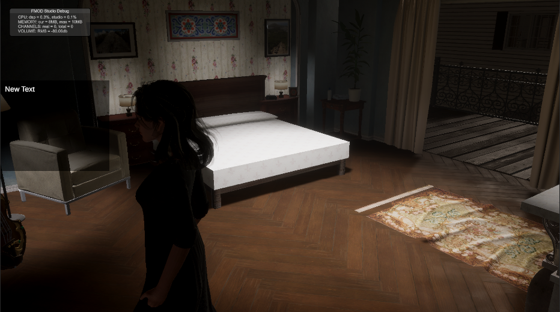

| Категория | Содержимое |
|-----------|------------|
| **Механики** | Диалоги, Интеракции с предметами, Переход между сценами |
| **Персонажи** | Lunora (реальная форма) |
| **Ресурсы** | — |
| **UI** | Диалоговое окно, Квестовая панель |

---

### DreamHub
Мир снов/фантазий, искаженный дом в фиолетовых тонах. Здесь появляется активный компаньон Dog, который следует за игроком. Отсюда можно попасть через зеркало в NightmareHub, через предметы в уровни Снов (Tutorial) и через взаимодействие с кроватью в любой уровень, а также в секретный уровень Car Level.

| Категория | Содержимое |
|-----------|------------|
| **Механики** | Диалоги, Интеракции, Компаньон (следование), Переход между сценами |
| **Персонажи** | Lunoris (призрачная форма), Dog |
| **Ресурсы** | — |
| **UI** | Диалоговое окно, Квестовая панель, Панель ресурсов |

---

### NightmareHub
Мир кошмаров/страхов, искаженный дом в красных тонах. Отсюда можно попасть через зеркало в DreamHub, через предметы в уровни Кошмаров (Nightmare Level).

| Категория | Содержимое |
|-----------|------------|
| **Механики** | Диалоги, Интеракции, Переход между сценами |
| **Персонажи** | Lunoris (призрачная форма) |
| **Ресурсы** | — |
| **UI** | Диалоговое окно, Квестовая панель, Панель ресурсов |

---

### Tutorial (уровень Снов)
*(TODO: добавить описание сцены и скриншот)*

| Категория | Содержимое |
|-----------|------------|
| **Механики** | *(TODO)* |
| **Персонажи** | Lunoris, Dog (?) |
| **Ресурсы** | *(TODO)* |
| **UI** | *(TODO)* |

---

### Elar (Open World)
Уровень с открытым миром, на данный момент доступен только из редактора Unity. Мир разделен на 9 сегментов, у каждого своя атмосфера и погода. На данный момент левел дизайна нет — просто плоская земля.

| Категория | Содержимое |
|-----------|------------|
| **Механики** | Open World навигация, Динамическая погода, Телепортация (дебаг) |
| **Персонажи** | Lunoris (?) |
| **Ресурсы** | *(TODO)* |
| **UI** | Панель ресурсов, Миникарта (?) |

**Сегменты Elar:**

| # | Сегмент | Атмосфера |
|---|---------|-----------|
| 1 | GardenOfAnger | Бурный вечер с грозой, молниями и порывистым ветром |
| 2 | GardenOfElarion | Редкий полуденный свет с магическим мерцанием в воздухе |
| 3 | GardenOfFear | Мрачная ночь с нагнетающей тьмой и холодной дымкой |
| 4 | GardenOfHope | Тёплый рассвет с мягким золотистым светом и пением птиц |
| 5 | GardenOfJoy | Яркий солнечный день с чистым небом и тёплым ветерком |
| 6 | GardenOfSadness | Тихая полночь с лёгким дождём и плотным туманом |
| 7 | GardenOfSerenity | Спокойный ясный день с мягкими облаками и лёгким бризом |
| 8 | GardenOfStillness | Безветренное утро с застывшим воздухом и лёгкой дымкой |
| 9 | GardenOfWonder | Волшебная полночь со звёздным небом и светящимися частицами |

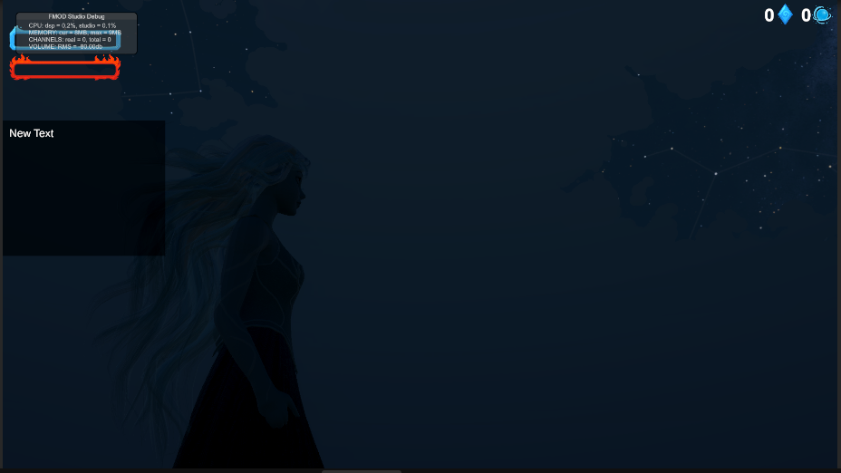

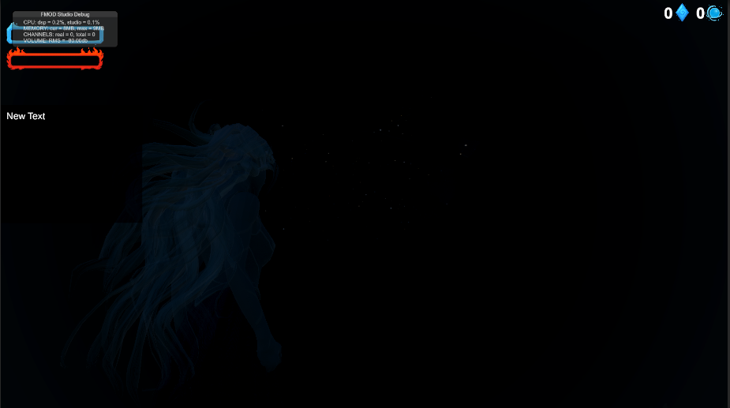

Игрок может попасть на любой сегмент, ходя по миру (загружаются динамически при приближении) или через дебаг-телепортацию.

---

### Car Level
Гоночный уровень в стиле раннера. Игрок управляет Chevrolet Impala, едет вперёд и пытается не попасть в аварию посредством маневрирования/дрифта.

**Особенности:**
- Машины на левой полосе уступают при мигании светом или при близком подъезде
- При проезде близко мимо препятствий (50% шанс) появляется QTE из 2 клавиш → буст
- 3 уровня буста: 110% → 130% → 170% скорости
- При максимальном бусте — 10 сек на верхнем уровне дороги без препятствий + Lucid Points
- Уровень заканчивается по таймеру (сейчас 1000 сек для дебага)

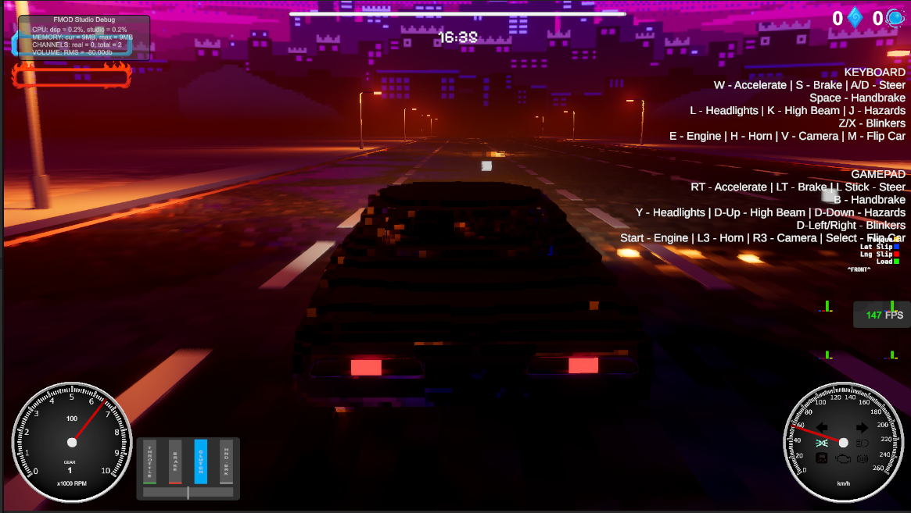

| Категория | Содержимое |
|-----------|------------|
| **Механики** | Контроллер машины, Дрифт, QTE, Система буста, Процедурная генерация дороги |
| **Персонажи** | Chevrolet Impala 1967 |
| **Ресурсы** | Lucid Points |
| **UI** | Таймер, Спидометр (?), Буст-индикатор (?), Lucid Points UI |

---

### Nightmare Level (уровень Кошмаров)
Уровень кошмара — скалистый пустырь в красных тонах с блэкаутом. Цель: дойти до телепорта и убить всех врагов.

**Враги:** 2× Лёгкий враг + 1× Ghost (Creature отключён, но можно включить)

**Боевая система:**
- Light комбо — быстрые лёгкие атаки
- Heavy комбо — медленные тяжёлые атаки
- Уклонение — сопровождается слоу-мо
- Парирование — сопровождается слоу-мо
- **Lucid Rush:** активируется при заполнении LucidMeter (0→100), +50 за удачное уклонение/парирование. При активации: замедление времени + 3 QTE с комбо. Каждое успешное QTE: +50% к урону (до +150%). Штраф за провал — стан игрока на 2 сек.

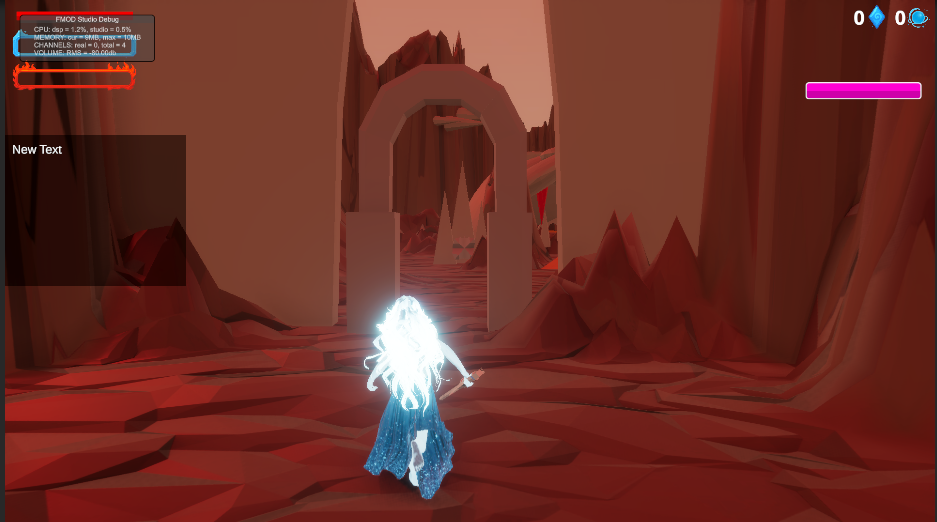

| Категория | Содержимое |
|-----------|------------|
| **Механики** | Боевка (Light/Heavy комбо), Уклонение, Парирование, Lucid Rush, QTE, Слоу-мо |
| **Персонажи** | Lunoris, Лёгкий враг ×2, Ghost, (Creature — опционально) |
| **Ресурсы** | Lucid Meter, HP |
| **UI** | HP Bar, Lucid Meter Bar, Панель ресурсов |

**Персонажи/Сущности:**
- Lunoris/Lunora/Kurtam - главная героиня игры, у неё есть две формы одна. Реальная - Lunora, и призрачная - Lunoris, а также одна форма животного.
- Dog - компаньон главной героини
- Chevrolet Impala 1967 года - машина которой управляет игрок в гоночном уровне
- Легкий враг - является хуманоидным плейсхолдером врага имеет небольшой урон и мало хп, получает случайное оружие при появлении
- Сreature - более сильный противник, может атаковать вблизи и издалека луком имеет гораздо больше хп
- Ghost - является плейсхолдером летающего врага

**Ресурсы:**
- **Loneliness Bar** — шкала одиночества нигде не используется.
- **Stress Bar** — шкала стресса (используется только в 2.5D уровне). Накапливается только при получении урона, за хит 35 единиц. Влияет на то куда попадет персонаж при смерти в 2.5D уровне
- **Echo Shard** — осколки эха, коллекционный ресурс. Можно достать из сундука в 2.5D уровне. Нигде не используется.
- **Lucid Points** — очки осознанности, зарабатываются в Car Level на верхнем уровне дороги и за успешные действия. Просто накапливается и нигде не используется.
- **Lucid Meter** — шкала осознанности в бою (0→100). +50 за удачное уклонение/парирование. При заполнении активирует Lucid Rush.

**Механики:**
- диалоговая система
- контроллер игрока (гибридный, от 1 лица, от 3 лица)
- контроллер игрока с боевыми механиками от внешней библиотеки и продвинутым Locomotion
- реалистичный контроллер машины
- система для процедурной и мануальной генерация дороги
- система для интеракций
- аниматор для кровати и кастсцены
  

**UI окна:**
- главное меню 
  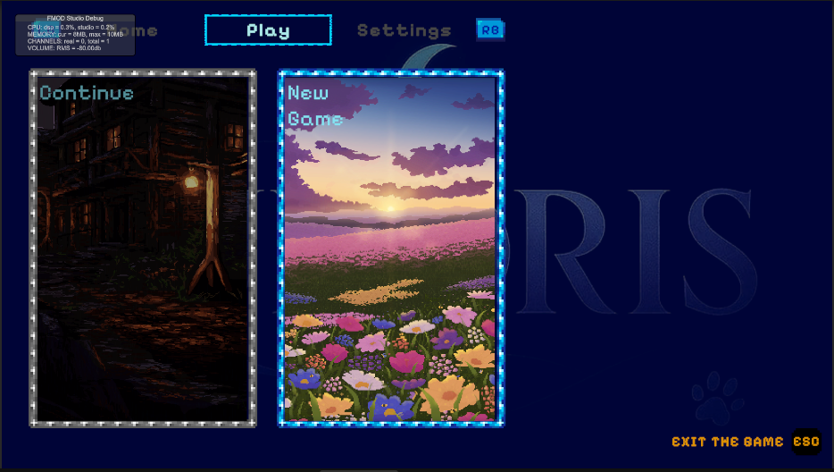
- окно паузы 
  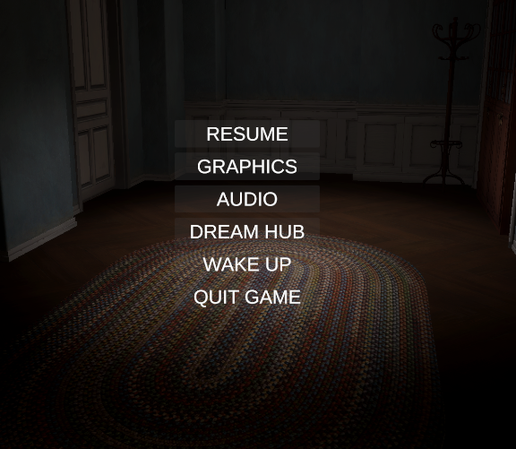
- окно настроек (графика и звуки)
  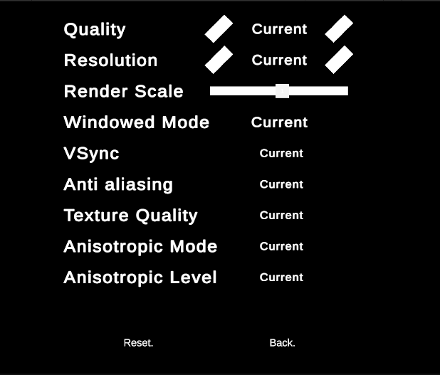
  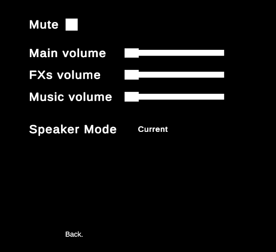
- квестовая панель
  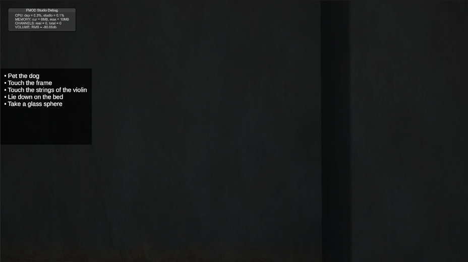
- панель ресурсов - включает в себя Loneliness Bar, Stress Bar, Echo Shard UI, Lucid Points UI
  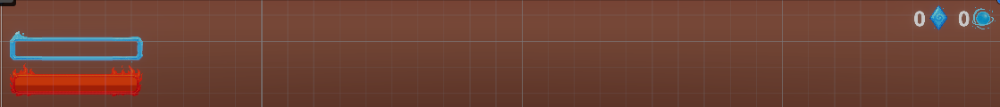
- диалоговое окно
  
- Бар Lucid Meter
  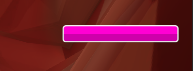
- Бар HP
  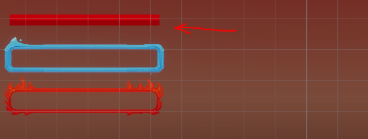

  