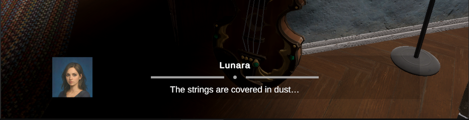

# Диалоговая система

> Система диалогов с объектами и NPC

---

## Описание

Система для отображения диалогов при взаимодействии с интерактивными объектами и персонажами.

---

## Где используется

| Сцена | Объекты |
|-------|---------|
| DayHome | Спящая собака, картина, виолончель |
| DreamHub | *(TODO)* |
| NightmareHub | *(TODO)* |
| Tutorial | *(TODO)* |

---

## UI

---

## Связанные механики

- [Система интеракций](interaction-system.md)
- [Prompt система](prompt-system.md)

---

← [Все механики](index.md) | [Вернуться к GDD](../index.md)
